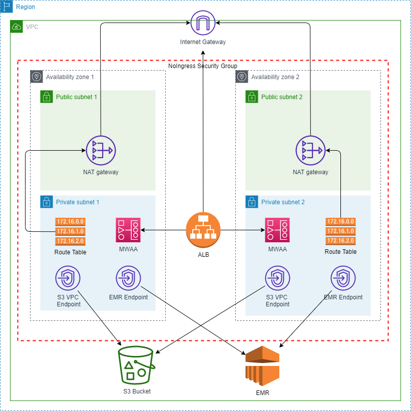

# Batch-ETL-Using-AWS-EMR-in-Managed-Airflow

## Motivation

Data aggregation can be time consuming and can use up large amount of computing resources; this is especially the case when working with large dataset. Having to manually unpdate this process each time new data is introduced requires immediate attention before a data worker can move on to other tasks such as data analysis and model training. Automating such a process with a reusable data pipeline that runs regularly is critical in boosting team performance. Data scientists or data analysts then may be freed up from cleaning the data, directly using the output data from this pipeline for data analysis or for training Machine Learning model. 

## Introduction

**Datasets**: The source data consists of three CSV files and are stored on Cloud in an Amazon S3 bucket. Each observation represents an individual's job posting; each column represents unqiue information about this applicant and the job applied to.
1. train_features.csv
2. test_features.csv
3. train_salaries.csv

### Amazon Managed Apache Airflow (MWAA)
Amazon Managed Apache Airflow (MWAA) is a serviced hosted on AWS that manage Apache Airflow on the server side. This takes away the user's responsibility in repetitively configuring the airflow environment, which can be unnecessarily time-consuming and mundane. I decided to launch an airflow environment on Amazon MWAA so I can manage the data pipeline without having to worry about the underlying hardware configuration. 

### Amazon Elastic MapReduce (EMR)
Amazon EMR can be used to process a large amount of data using tools such as Apache Hadoop/Spark. The user can easily provision resources for the clusters in a highly scalable  
Big Data environment. 

**Goal**: Launch an Amazon MWAA environment to create a data pipeline that orchestrates a batch ETL processing workflow in Amazon EMR.

**Architecture Overivew**: At a high level, the AWS cloud environment for this project is illustrated below.

 
- The Amazon MWAA environment requires a VPC that spans across 2 different availability zones, each of which consists of a public and a private subnet, respectively. 
- The airflow environment will run in the private subnets and be connected to the internet through a NAT gateway in the public subnets. 
- A S3 gateway VPC endpoint is established in each availability zone to ensure private connection between Amazon MWAA and Amazon S3.
- An EMR interface VPC endpoint is established in each availability zone to ensure secure connection to Amazon EMR from Amazon MWAA.

## Pipeline Design

