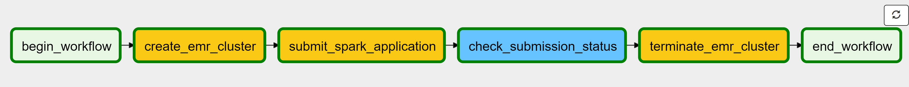

# Batch-ETL-Using-AWS-EMR-in-Managed-Airflow

## Motivation

Data aggregation can be time consuming and can use up large amount of computing resources; this is especially the case when working with large dataset. Having to manually unpdate this process each time new data is introduced requires immediate attention before a data worker can move on to other tasks such as data analysis and model training. Automating such a process with a reusable data pipeline that runs regularly is critical in boosting team performance. Data scientists or data analysts then may be freed up from cleaning the data, directly using the output data from this pipeline for data analysis or for training Machine Learning model. 

## Introduction

**Datasets**: The source data consists of three CSV files and are stored on Cloud in an Amazon S3 bucket. Each observation represents an individual's job posting; each column represents unqiue information about this applicant and the job applied to.
1. train_features.csv
2. test_features.csv
3. train_salaries.csv

**Amazon Managed Apache Airflow (MWAA)**: A service hosted on AWS that manage Apache Airflow on the server side. This takes away the user's responsibility in repetitively configuring the airflow environment, which can be unnecessarily time-consuming and mundane. I decided to launch an airflow environment on Amazon MWAA so I can manage the data pipeline without having to worry about the underlying hardware configuration. 

**Amazon Elastic MapReduce (EMR)**: Amazon EMR can be used to process a large amount of data using tools such as Apache Hadoop/Spark. The user can easily provision resources for the clusters in a highly scalable Big Data environment. 

**Amazon CloudFormation**: A service that provisions a set of infrastructure resources in a reuseable way by a template. For example, you can launch multiple AWS services simultaneously by specifying the corresponding configuration.

## Goal
Launch an Amazon MWAA environment to create a data pipeline that orchestrates a batch ETL processing workflow in Amazon EMR.

## Architecture Overview
At a high level, the AWS cloud environment for this project is illustrated below. 

 
An Amazon MWAA environment requires the following resources:
- a VPC that spans across 2 different availability zones, each of which consists of a public and a private subnet, respectively. 
- a NAT gateway with a route table in each public subnet to connect to the internet 
- A S3 gateway VPC endpoint in each availability zone to ensure private connection between Amazon MWAA and Amazon S3.
- An EMR interface VPC endpoint in each availability zone to ensure secure connection to Amazon EMR from Amazon MWAA.

All the above resources are provisioned in the template airflow_cft.yml using Amazon CloudFormation. These are essential in properly setting up the airflow environment in AWS MWAA. Reference the workflow diagram below for a clearer illustration. 

## Workflow Diagram

## Pipeline Design

At a high-level, the data pipeline orchestrates the following tasks:
1. Trigger the DAG
2. Provision an EMR cluster
3. Submit a spark step in the EMR cluster nodes that executes the ETL workflow 
4. Wait for the spark submission to complete
5. Terminate the EMR cluster
6. End the DAG

## Getting Started

***1. Create an Amazon S3 bucket in the same region where you are creating the Amazon MWAA environment***

- Make sure the bucket name starts with 'airflow-' in order to be compatible with the template we will use later on. 
- Upload the data, the avg_sal_etl.py file, the CloudFormation template airflow_cft.yml, and the DAG.py file for the data pipeline.

***2. Launch the MWAA airflow environment in CloudFormation with airflow_cft.yml***

- Wait for the template to complete; it should take around 20 minutes.

***3. Go to Amazon Managed Apache Airflow and open the airflow UI***

- Turn on to start the DAG. Manually trigger the DAG if necessary. 
- The airflow DAG runs on the DAG.py file in s3://airflow-salary-prediction-de/dags/

***4. Amazon EMR cluster automatically provisioned and Spark application submitted***

- Go to Amazon EMR and find the cluster that's running.
- Double check that the average salary step is in queue waiting to be executed.

- The DAG schedule interval for the DAG is `0 0 0 * *`; if the DAG keeps staying ON it will be triggered once every day at 12:00 AM. Once the Spark step is completed, we should see that all the steps succeeded like in the follwing tree view in the airflow UI

***5. After the Spark step is completed, go to S3 bucket and check the output***

